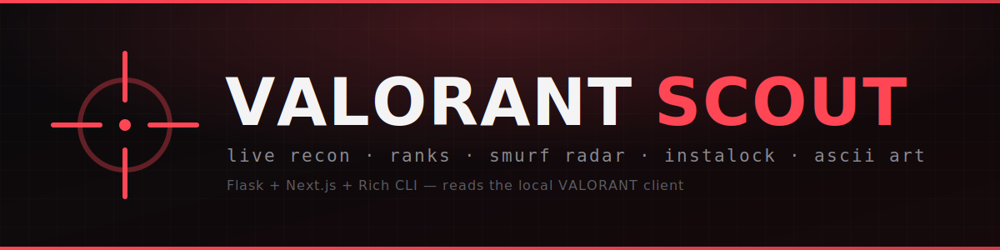
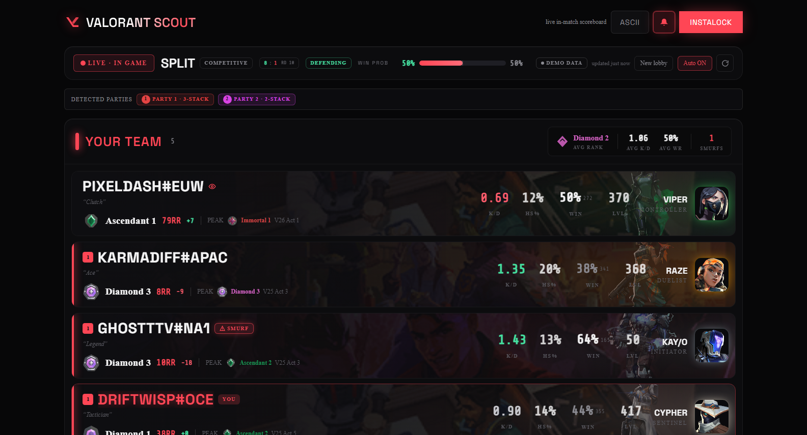
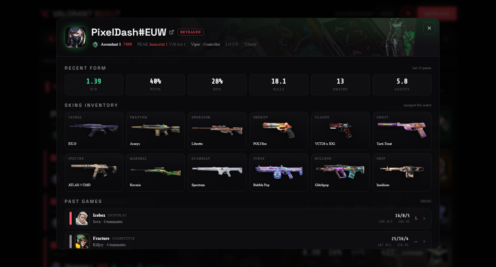
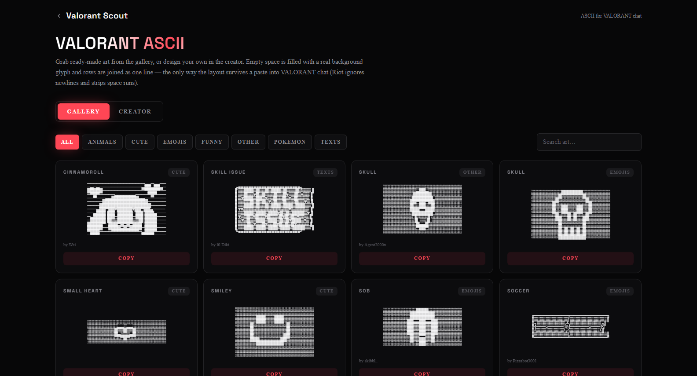
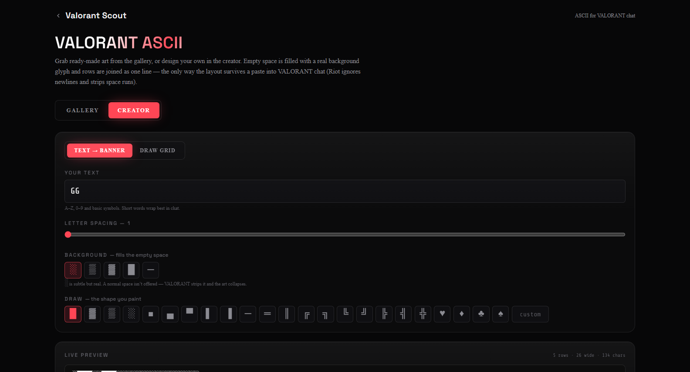
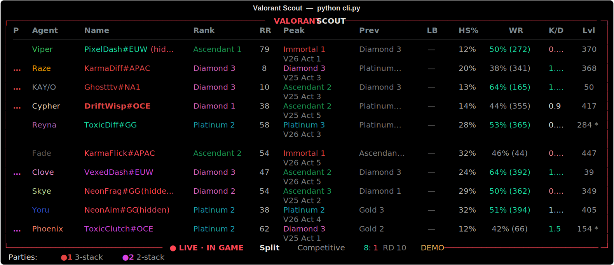
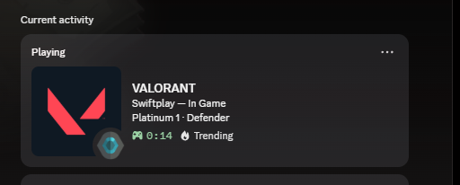

<div align="center">



# Valorant Scout

**Live in-match intelligence for VALORANT — see every player's rank, peak, K/D, win-rate, smurf risk, full skin inventory and party before the round even starts.**

Reads your **local VALORANT client** in real time and renders it as a slick web dashboard, a colour-coded terminal scoreboard, and your **Discord status** — plus an instalock helper, a cross-session encounter log, and a VALORANT chat **ASCII art studio**.

### 🌐 [**valorantscout.vercel.app**](https://valorantscout.vercel.app)
Try the live dashboard right now — it runs in **demo mode** with VALORANT closed, no install needed.

[Features](#-features) · [Quick start](#-quick-start) · [Screens](#-screens) · [CLI](#-terminal-cli) · [Discord](#-discord-rich-presence) · [Config](#-configuration) · [Credits](#-credits)

`VALORANT` · `rank tracker` · `live scoreboard` · `smurf detector` · `instalock` · `incognito name reveal` · `discord rich presence` · `ascii chat art` · `Flask` · `Next.js` · `Rich CLI`

</div>

---

## 🌐 The website — [valorantscout.vercel.app](https://valorantscout.vercel.app)

The dashboard lives at **[valorantscout.vercel.app](https://valorantscout.vercel.app)** — the very same
web app `start.bat` opens for you. The site is **only the UI**: it connects securely back to the Scout
app running on your own PC over a local, token-authenticated link, so **your match data never leaves
your machine** and nothing is stored on a server. No account, no login, nothing to host yourself.

- **Always up to date** — you get the latest dashboard automatically; the desktop app just runs the local data bridge.
- **View on phone** — once Scout is running, scan the in-app QR to open a read-only board on your phone through the same site.
- **Demo mode** — with VALORANT closed the site shows a fully-populated demo lobby, so you can explore the UI before installing.

---

## ✨ Features

### 🎯 Live in-match scoreboard
- **Every player, both teams** — pulled live from the local client the moment you hit Agent Select or load in.
- **Rank, RR & leaderboard place**, current act + **peak rank with the act it was hit** (`V26 Act 1`), and previous-act rank.
- **K/D and HS%** — competitive-aware: in a ranked game these aggregate the player's **last 5 competitive matches**; in other modes, their most recent game.
- **Win-rate & games** for the active act.
- **Account level** (recovered from match history even when the client hides it).
- **Party detection** — colour-coded groups so you instantly see the 3-stack on the enemy team.
- **Per-team averages** — avg rank, avg K/D, avg WR, smurf count, and a live **win-probability** bar.

### 🕵️ Smurf radar
Heuristic flags that combine **account level vs. peak rank**, **K/D**, and **win-rate** to surface likely smurfs — with the reasons shown on hover.

### 👤 Deep player profiles
Click any player for a full drill-in:
- **Recent form** — K/D, win%, HS%, K/D/A averages.
- **Full weapon skin inventory** with real skin art (Standard guns show the base weapon render).
- **Past games** — agent, map, result, K/D/A, ACS, HS% — click into any match for the full scoreboard.
- **Encounters** — how many times you've queued **with or against** this player across sessions.
- One-click **tracker.gg** deep link.

### 🔓 Hidden-name handling
Resolves Incognito ("hidden") names where the client allows it, and never renders a bare `#` — unknowns fall back to a clean `Player-XXXX` tag.

### ⚡ Instalock & agent-select tools
- **Auto-instalock** that loops until your agent is locked (or you hit stop), with **per-map agent presets**.
- **Check side** (attack/defend) and **dodge** buttons.
- **Region selector** (NA / EU / AP / KR / LATAM / BR) with auto-detect.
- **Dry-run by default** — you explicitly opt in before anything touches the client.

### 🗂️ Encounter log
A local JSON ledger of everyone you've played with or against, with play counts and their latest stats — so "haven't I seen this Jett before?" finally has an answer.

### 🎮 Discord Rich Presence
Shows your VALORANT status on your Discord profile: **map, mode, rank, agent, side and live score** across lobby / agent-select / in-game.

### ⌨️ Terminal CLI
A fast, colour-coded `rich` scoreboard for a second monitor — same data, no browser.

### 🖌️ VALORANT ASCII studio
- A searchable **gallery** of chat-ready ASCII art across categories (Animals, Cute, Emojis, Funny, Texts, …).
- A **creator** with a text→banner generator and a paintable draw grid.
- Output is encoded the way VALORANT chat actually needs it (visible background fill, fixed-width rows, single-space joins) so the art survives the paste.

### 🎨 Built to look good
Cinematic dark UI, Framer-Motion animation, big readable type, agent splash art, and a reduced-motion-friendly fallback.

---

## 🚀 Quick start (Windows — no coding needed)

**Supported:** Windows 10/11 **x64**, standard user account. The installer sets up its own
CPython **3.12.10 x64** runtime (verified download from python.org) — other Pythons on your PC
are never touched. ARM64 and 32-bit Windows are not supported.

1. **Download the latest release ZIP** from the
   [Releases page](https://github.com/kryotrades/valorant-scout/releases/latest)
   (`valorant-scout-v<version>-windows-source.zip`) and **extract it** anywhere
   (right-click → Extract All — don't run it from inside the ZIP).
2. Double-click **`install.bat`** — one-time setup **and** repair tool. It verifies (or installs)
   the exact Python runtime, installs pinned packages, asks you to **pick your region**, and drops
   a **Valorant Scout** shortcut on your Desktop. Safe to re-run any time — it only fixes what's
   broken and never touches your settings or data.
3. Double-click **`start.bat`** (or the Desktop shortcut) any time to launch. It **keeps itself
   up to date automatically**: every launch checks for a newer release and, if there is one,
   installs it (staged, checksum-verified, and rolled back automatically if anything fails)
   **before** starting — so you're always on the latest version. Offline or GitHub unreachable?
   It just launches your current version and tries again next time. Your settings, region and
   match data are always preserved.
   - `UPDATE.bat` does the same update on demand (e.g. to update without relaunching).
   - Something not working? Just run `install.bat` again — it repairs a broken setup in place
     without touching your settings or data.
   - Logs live in the `.scout` folder (`launcher.log`, `backend.log`, `install.log`, …).

The dashboard is served from the web and connects **securely back to the app running on your PC** —
your match data never leaves your machine. The first time, your browser may ask to **allow access to
your local network** — click **Allow** (Chrome or Edge recommended). **“View on phone”** then works
out of the box — scan the QR to control Scout from your phone.

That's it — **no `.env` or config to edit, and no Node.js build.** With VALORANT closed it runs in a
fully-populated **demo mode**, so you can explore the UI any time.

> Windows SmartScreen may warn about a downloaded `.bat` — choose *More info → Run anyway*.

### Developers / manual run
```bash
pip install -r backend/requirements.txt
python run.py            # backend + terminal scoreboard, against the hosted dashboard
python run.py --no-cli   # backend only (no terminal window)
python run.py --cli      # terminal scoreboard only
```
By default the app opens the hosted dashboard; point it elsewhere with `FRONTEND_URL` in
`backend/.env`. The full source (Flask backend **+** Next.js frontend) lives in the development repo
if you want to run or modify the website locally. For that explicit developer mode, run
`install.bat -Frontend` once, then use `python run.py --local-frontend` (or set
`SCOUT_LOCAL_FRONTEND=true`). Merely having a `frontend/` folder never makes normal startup require
Node.js, so a copied/private checkout still works on a clean PC through the hosted dashboard.

---

## 🖼️ Screens

### Live scoreboard


### Player profile


### ASCII chat-art studio — gallery & creator



### Terminal CLI


### Discord Rich Presence


---

## ⌨️ Terminal CLI

```bash
python cli.py                 # live table, refreshes every 5s
python cli.py --once          # print once and exit
python cli.py --interval 3    # custom refresh seconds
python cli.py --seed 12       # pick a demo lobby
```

Columns: Party · Agent · Name · Rank · RR · Peak (with act) · Previous · Leaderboard · HS% · Win-rate · K/D · Level.

---

## 🎮 Discord Rich Presence

Enabled by default — just have the **Discord desktop app** running. It updates every ~15s with your map, mode, rank, agent, side and live score. Disable it with `DISCORD_RPC=false` in your `.env`.

---

## ⚙️ Configuration

Copy `backend/.env.example` to `backend/.env`. **Everything is optional** — the app runs in demo mode with nothing set, and when VALORANT is open your PUUID is detected automatically from the running client (no need to enter it).

| Key | What it does |
|-----|--------------|
| `RIOT_API_KEY` | Optional official Riot API key (improves name resolution). |
| `RIOT_REGION` | Pin your region (`na`, `eu`, `ap`, `kr`, `latam`, `br`) instead of auto-detect. |
| `DATA_SOURCE` | `auto` (live if the client is running, else demo), `live`, or `demo`. |
| `DISCORD_RPC` | `true` / `false` — toggle Discord Rich Presence. |
| `ALLOW_LIVE_INSTALOCK` | `true` / `false` — allow real (non-dry-run) instalock/dodge. |

---

## 🏗️ How it works

```
VALORANT local client  ──►  Flask API (backend/)  ──►  Next.js dashboard (frontend/)
   lockfile + edge APIs        live_match pipeline         React + Tailwind + Motion
                                    │  └─►  Rich terminal CLI (cli.py)
                                    └─►  Discord Rich Presence (pypresence)
```

- **`backend/`** — Flask service: live scoreboard pipeline, rank/stat resolution, party detection, encounter log, instalock worker, Discord presence. Art metadata is resolved from the public [valorant-api.com](https://valorant-api.com) CDN, so no binary assets are bundled.
- **`frontend/`** — Next.js (pages router) + Tailwind + Framer Motion.
- **`cli.py`** — standalone terminal scoreboard.
- **`run.py`** — one-command launcher for the whole stack.

---

## 🙏 Credits

Valorant Scout stands on the shoulders of the community projects that mapped out the local client and inspired these features:

- **[VALORANT-rank-yoinker](https://github.com/zayKenyon/VALORANT-rank-yoinker)** — the live scoreboard / rank pipeline and Discord presence approach.
- **[Fast-Pick](https://github.com/Imu-D-sama/Fast-Pick)** — the instalock, check-side and dodge flow, and region handling.
- **[ValForge](https://valforge.gg/ascii)** — the community, free-to-use, open-source ASCII gallery that seeds the chat art studio (credit to its individual art creators).
- **[valorant-api.com](https://valorant-api.com)** — agent / weapon / rank / map / season art and metadata.

Huge thanks to all of them. ❤️

---

## 🔄 Updating

`start.bat` **auto-updates on every launch**: it checks for a newer release and, if one exists,
applies it before starting the app (offline or GitHub unreachable → it just launches your current
version and retries next time). `UPDATE.bat` runs the same thing on demand. Either way the update
is a **verified transaction**: the release is downloaded to a staging folder, its SHA-256 checksums
and file manifest are verified, the current version is backed up, the new one is activated and
boot-checked, and on any failure the previous version is restored automatically. Your settings
(`backend/.env`), match data (`backend/data`) and logs (`.scout`) are never part of the transaction.
(On a developer checkout — a `.git` folder present — auto-update is skipped; use `git pull`.)

**Cutting a release (maintainers):** bump `VERSION` **and** `runtime.json` (checked by
`scripts/verify-version.ps1`), commit, run `scripts/build-release.ps1 -Version <v> -Output dist`,
verify with `scripts/verify-release.ps1`, then publish a GitHub Release whose tag matches with all
three assets: the ZIP, `release-manifest.json` and `SHA256SUMS.txt`. The updater refuses releases
that are missing any of them.

## 📜 License

Licensed under the **GNU General Public License v3.0** — see [`LICENSE`](LICENSE). © 2026 kryotrades.

## ⚠️ Disclaimer

Valorant Scout is a third-party tool and is **not affiliated with, endorsed by, or sponsored by Riot Games**. It reads the local client's APIs and can automate parts of agent select; **client automation may violate Riot's Terms of Service** and is provided for educational use. Instalock / dodge are **dry-run by default** — you opt in at your own risk.
